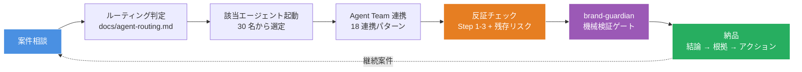
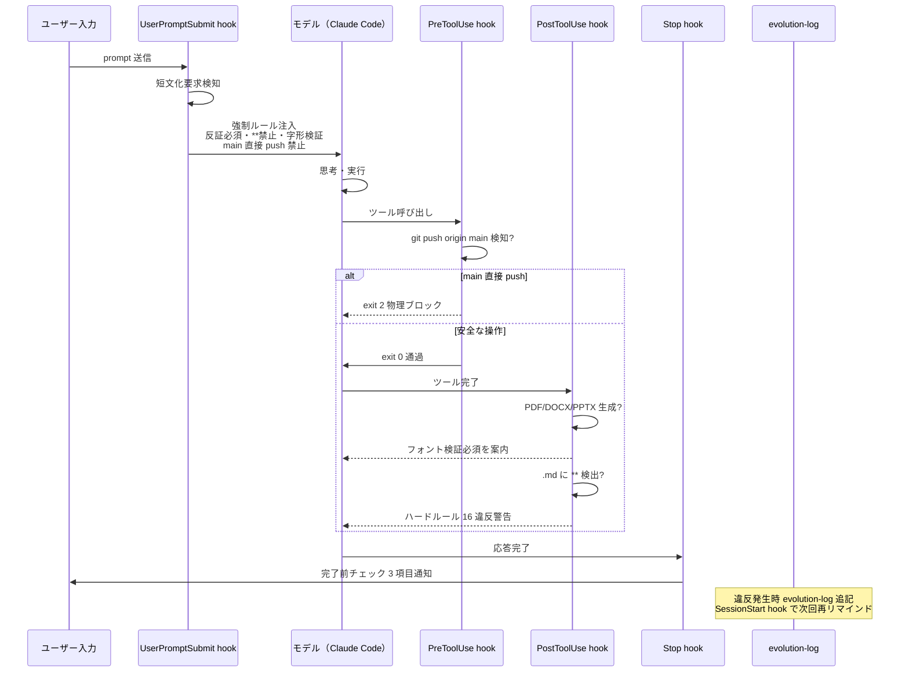
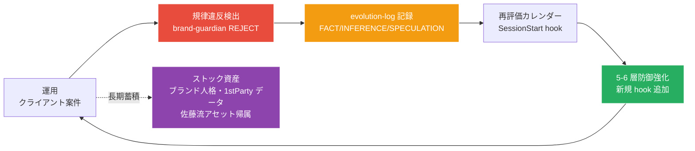

# ConsultingOS

コンサル / サービス開発 / プロダクト / クリエイティブ / グローバル / マーケティングの 6 部門・31 エージェント・26 スキル（直下 18 + サブディレクトリ 8）で提案から実装・海外展開・マーケまで一気通貫のマルチエージェント OS。

## 司令塔ダイアグラム（1 枚で構造把握）


## バリューチェーン（クライアント案件の流れ）



## 6 層防御の発動順序



## 司令塔ダイアグラム（自己進化サイクル）



## 商業実績

| 案件 | クライアント | 内容 | 受注金額 | 期間 | ステータス |
|---|---|---|---|---|---|
| Hotice セールスデッキ | Hotice（performance marketing agency） | B2B セールスデッキ HTML/CSS 18 スライド + Puppeteer レンダリングパイプライン | 月 5 万円 | 3 ヶ月（15 万円） | 受注済 |

成果物は [`examples/hotice-sales-deck/`](./examples/hotice-sales-deck/) に格納。sales-deck-designer + brand-guardian + claude-design-handoff スキル経由で制作。佐藤裕介モード（具体性・ハルシネーション検出・競合比較表）+ 日本語字形禁則 + 出力フォーマット規律を全適用。

## 自社事業（進行中プロジェクト）

ConsultingOS の運用検証を兼ねた自社プロジェクト。クライアント案件と分離して管理。

| 事業 | 性質 | 状態 | 主要活用エージェント / スキル |
|---|---|---|---|
| よるのことば | 占いサービス（Web）| 進行中 | content-strategist + ux-designer + frontend-dev + `/website-audit` + brand-guardian |
| わんちゃん成長日記 | iOS アプリ化検討（Web PoC 先行推奨）| 計画中 | tech-lead + fullstack-dev + ai-engineer + Claude Code iOS 実機テスト |

注意:
- よるのことば（占いサービス）は景品表示法 / 占い表現規制（「当たる」断言禁止）の `legal-compliance-checker` 事前審査必須
- わんちゃん成長日記は佐藤裕介流プロトタイプ・ファースト原則で「Web PoC → SaaS 化 → アプリ化」の段階的検証を推奨
- ICP.md ペルソナ A（25-35 歳女性・スマホ占い主要利用層）と「よるのことば」が完全整合 = 既存 ICP 仮説の検証機会

## 構成サマリ

| 項目 | 値 |
|---|---|
| エージェント | 31 名（6 部門） |
| スキル | 26 件（直下 18 + サブディレクトリ 8） |
| コマンド | 6 個 |
| CLAUDE.md | 119 行・ハードルール 17 |
| 防御層 | 6 層 × 4 系統（反証 / 字形 / 出力フォーマット / 規律違反学習） |
| hook | 5 種（UserPromptSubmit / PreToolUse / PostToolUse / Stop / SessionStart） |
| evolution-log | 違反学習 7 件記録 |
| 再評価カレンダー | 7 項目（自動通知） |
| SDK 化 | Phase 1 PoC（claude-code-action@v1） |

## 主要規律

| 規律 | 出典 |
|---|---|
| 反証モード Step 1-3 + 残存リスク必須 | OS 独自規律 |
| 出典 3 ラベル（FACT / INFERENCE / SPECULATION）| 2026-05-01 違反学習 |
| 日本語字形検証必須（pdffonts / unzip+grep）| 2026-05-01 違反学習 |
| 出力フォーマット規律（`**` 禁止 / 改行 / 中央揃え / 収まり / W チェック）| 2026-05-01 違反学習 |
| main 直接 push 禁止（PreToolUse 物理ブロック）| 2026-05-02 違反学習 |
| GitHub アカウントセキュリティ 18 ルール | マネーフォワード事案学習 |

## 思想的基盤

- 佐藤裕介流: PL 思考・市場構造・3 変数交点・アセット帰属診断・コンセンサス疑念・ruthlessly edit
- 小野寺信行流: 指標を疑う・1stParty データ中心・フロー × ストック統合・代理店 R&D 機関化
- Boris Cherny 流 9 規律: Plan Mode・自己検証・形骸化ルール削除・権限明示
- Anthropic 公式（Sid Bidasaria SDK / Thariq セッション管理 5 つの術）

## Anthropic 公式エコシステム + ConsultingOS 規律レイヤー

> Phase 6 商品化セールス訴求軸（2026-05-05 設計確定）。Anthropic 公式との互換性を保ちながら、上位レイヤーで規律・反証・物理ブロック・6 部門統合を実装する唯一の規律 OS。

### 関係性の一言定義

Anthropic 公式は「素材」、ConsultingOS は「料理」。Claude Code / MCP / Skills / Agent SDK / Plan Mode は強力な食材だが、調理手順・衛生管理・品質保証の仕組みは含まれない。ConsultingOS はその「調理場の OS」として、素材の上位レイヤーで規律・反証・物理ブロック・6 部門統合を実装している。フレームワークは「何をできるか」を定義し、組織 OS は「何をすべきでなく、何が起きたら即停止するか」を物理的に強制する。この差が「使えるが危ない AI」と「安全に出荷できる AI 組織」を分ける。

### 30 秒ピッチ（Phase 6 セールス用）

Anthropic が「Claude Code でエージェントを作れる」ようにした。ConsultingOS はその上で「規律ある会社として動く」ようにした。反証ゲート・物理ブロック・6 部門 30 エージェント連動・自己進化ログを実装済みで、Anthropic 公式機能との完全互換を保ちながら、「危険な AI ツール」から「出荷可能な AI 組織 OS」に昇格させる規律レイヤーである。

### 対照テーブル（Anthropic 公式素材 vs ConsultingOS 規律 OS）

> ラベル凡例: FACT = 公式ドキュメント確認済 / INFERENCE = 機能比較から推定 / SPECULATION = 将来仕様変更の可能性あり

| Anthropic 公式が提供する「素材」 | ConsultingOS が追加する「規律」 | 実装場所 | ラベル |
|---|---|---|---|
| Claude Code 本体（推論・生成・ファイル操作） | 反証モード Step 1-3 + 残存リスクを全アウトプットに物理強制。UserPromptSubmit hook で注入 + Stop hook で完了後検証の二重構造 | CLAUDE.md ハードルール 1 + `.claude/hooks/` 2 ファイル | FACT |
| MCP（外部ツール接続標準） | 外部 API POST/PUT/DELETE は承認必須。MCP 書き込みは PreToolUse exit 2 で物理ブロック。「接続できる」と「書き込みを許可する」を分離 | `settings.json` permissions.deny + `orchestration-block.sh` | FACT |
| Skills（SKILL.md 形式の専門能力テンプレート） | 19 スキル + 6 部門 30 エージェントへの配布ルール整備。SKILL.md 500 行以下制約で形骸化を防止。追加は削除とセット（Boris #3 ruthlessly edit） | `.claude/skills/` + `evolution-log.md` 再評価カレンダー | FACT |
| Agent SDK（subagent / Task tool 並列起動インフラ） | 起動前 4 点ゲート必須（ブランチ確認 / ファイル存在 / 依存先 / ICP・DESIGN 確認）。ゲート未通過の単独実行を `recommend-agents.sh` block モードで即停止 | CLAUDE.md ハードルール 17 + `recommend-agents.sh` warn/block モード | FACT |
| Plan Mode（Shift+Tab × 2 の計画モード） | 3 ファイル以上 / アーキテクチャ判断 / 本番影響 の 3 条件でトリガー義務化。条件の裁量余地をなくし形骸化を防ぐ | CLAUDE.md §4 Workflow Plan Mode 節 | FACT |
| hook（イベント駆動の外部スクリプト実行） | 5 hook × 3 物理検証レイヤー（入力 → ツール前 → ツール後 → 応答完了）を実装。Anthropic 公式はイベント通知のみ提供、ConsultingOS は「応答内容品質ゲート」として機能拡張 | `.claude/hooks/` 5 ファイル（orchestration-block / stop-validator / recommend-agents 等） | FACT |
| git 操作（Bash tool 経由のバージョン管理） | main 直接 push を PreToolUse exit 2 で物理ブロック。feature branch + PR + Squash merge を強制。「できる」操作と「すべき」操作を分離 | `orchestration-block.sh` + `settings.json` deny | FACT |
| 英語出力（LLM デフォルト言語） | 英語出力には日本語訳必須（ハードルール 11）。日本語出力は ja-JP フォント検証必須（ハードルール 10）。クライアント向け納品物の品質を OS レベルで担保 | `brand-guidelines.md` + `brand-guardian` エージェント + PostToolUse hook | FACT |
| evolution-log（Anthropic 非提供） | 規律違反を FACT/INFERENCE/SPECULATION ラベル付きで自己記録。SessionStart hook で次回セッション起動時に期限到達項目を自動リマインド。使い続けるほど規律が強化される自己進化サイクル | `evolution-log.md` + SessionStart hook | FACT |
| Stop hook 応答検証（Anthropic 非提供） | 禁止フレーズ 5 種（「自分で書いた方が早い」等）+ 反証未付与を応答完了時に物理検知。warn → block モード移行で段階的に規律強度を引き上げ | `.claude/hooks/stop-validator.sh` | INFERENCE（仕様変動リスクあり、2026-05-12 再検証予定） |

出典（FACT）:
- Anthropic 公式 Claude Code SDK: https://docs.anthropic.com/en/docs/claude-code
- Anthropic Skills 67 選評価: `evolution-log.md` 2026-05-05 エントリ（ConsultingOS 上位互換判定、Git Guardrails / Multi-Agent Consensus で先行実装確認）
- Khairallah 40 features 評価: 同エントリ内の機能差分判定記録
- Anthropic + Google Cloud Agent Stack 評価: 同エントリ（6 層防御との対比）

### ConsultingOS 独自価値 5 軸（Anthropic 公式には不在）

> 以下の 5 軸はいずれも Anthropic 公式 SDK / Skills / MCP 標準には含まれず、ConsultingOS が独自実装している規律コンポーネントである（FACT: 2026-05-05 時点の公式ドキュメント比較に基づく。将来の Anthropic リリースで一部実装される可能性は SPECULATION として留保）。

軸 1: 反証モード Step 1-3 + 残存リスク必須化

全アウトプットの末尾に「Step 1 自己反証 / Step 2 構造反証 / Step 3 実用反証 + 残存リスク列挙」を物理強制する。UserPromptSubmit hook による注入と Stop hook の応答完了後検証の二重構造で省略を物理的に不可能にしており、単なるプロンプトルールではなく hook レベルで実施するためモデルが指示を「忘れる」ことが構造上起きない。

軸 2: ハードルール 17 物理化（起動前 4 点ゲート + PreToolUse 物理ブロック）

ルールをテキストで書くだけでなく exit 2 で物理ブロックする。main 直接 push / 外部 API 書き込みの無承認実行 / オーケストレーター不在の単独実行は hook レベルで即停止する。CLAUDE.md のルールが形骸化した場合でも hook が第 6 層として二重防御を維持する（6 層規律防御）。

軸 3: 6 部門 30 エージェント統合 + 4 兼務体制（連動推奨）

コンサル → 実装 → プロダクト → クリエイティブ → グローバル → マーケティングの 6 部門が `agents.routing.tsv` の secondary 列で連動推奨設計済み。strategy-lead 起動時に competitive-analyst + kpi-analytics が自動推奨し、proposal-writer 起動時に sales-deck-designer + kpi-analytics + strategy-lead が連動する。「1 依頼 = 1 エージェント」から「1 依頼 = 関連部門全連動」への構造転換で AI 会社としての稼働を実現する。

軸 4: evolution-log + 再評価カレンダー（自己進化）

規律違反を `evolution-log.md` に FACT/INFERENCE/SPECULATION ラベル付きで記録し、SessionStart hook が次回セッション起動時に期限到達項目を自動リマインドする。違反 → 記録 → hook 強化 → 再評価 → アーカイブの自己進化サイクルを回しており、2026-05-05 時点で 7 件の違反学習・7 項目の再評価カレンダー登録済み（FACT）。「使い続けるほど規律が強化される OS」はプロダクトバリューではなく構造で担保されている。

軸 5: Stop hook 応答内容検証（禁止フレーズ + 反証未付与）

応答完了直前に `stop-validator.sh` が最新 assistant 応答を解析し、禁止フレーズ 5 種（「自分で書いた方が早い」「形式変換だから例外」等）と反証チェック未付与を物理検知する（warn → block モード移行判断式）。Anthropic 公式 Stop hook はイベント通知のみを提供するが、ConsultingOS はその上で「応答内容の品質ゲート」として機能拡張している点が独自価値である。

### Phase 6 商品化における差別化ポジション

| 競合カテゴリ | 競合の訴求 | ConsultingOS の反論 | 勝ち筋 |
|---|---|---|---|
| 単発プロンプト集 / プロンプトエンジニアリング | 即使える・導入ゼロコスト | プロンプトはモデルが「忘れる」、hook は物理的に「忘れない」。長期運用品質で桁違いの差が出る | 規律の持続性 |
| 個別 AI ツール（Cursor / v0 / Copilot 等） | 領域特化で深い | 1 ツール = 1 機能に留まり、経営判断 → 実装 → マーケの一貫性が断絶する | 6 部門統合による一貫性 |
| Anthropic / Google 公式エージェントスタック | 公式サポート・最新機能 | 公式は「できる」を提供、ConsultingOS は「すべき / してはいけない」を物理強制する。互換かつ上位 | 規律の物理強制という上位互換 |
| 自前 LLM 構築 / 社内 AI 内製 | 機密対応・カスタマイズ | 構築コスト 0（既存 Claude Code に上乗せ）、6 部門 30 エージェントは内製の 1/10 の期間で到達 | 導入速度 × コスト構造 |
| 大手コンサルファーム | 人的リソース・実績 | 属人化必至の人的モデル vs 再現可能な構造モデル。佐藤裕介流「構造・再現性で売る」に完全対応 | 再現性・スケーラビリティ |

## Stage 進化ロードマップ

| Stage | 状態 | 例 | ConsultingOS の現在地 |
|---|---|---|---|
| 1. AIを使う | 対話的 | Claude Code セッション | 主軸 |
| 2. AIで自動化 | 単発タスクをコマンド化 | claude -p / パイプ | 一部活用 |
| 3. AIで出荷する | 本番システムに組み込み | GitHub Actions / SaaS | Phase 1 PoC 着手 |

## Phase 1-6 統合ロードマップ（AI 会社化）

ユーザービジョン「すべての依頼で AI エージェントが起動、佐藤裕介オーケストレーションで全リード・部署が連動、AI 会社として稼働する世界」を Phase 1-6 で段階到達。Phase 1-4 完了、Phase 5 設計完了（2026-05-04）、Phase 6 構想中。

| Phase | テーマ | 状態 | コア価値 |
|---|---|---|---|
| 1 | 規律基盤確立 | 完了 | 反証モード必須・FACT/INFERENCE/SPECULATION 3 ラベル・evolution-log |
| 2 | 6 部門 30 エージェント整備 | 完了 | コンサル → 実装 → マーケ → 海外まで一気通貫 |
| 3 | 6 層物理防御 | 完了 | hook によるルール違反の物理ブロック |
| 4 | Orchestrator 強制化 | 完了（PR #32 / #34）| 起動前 4 点ゲート + PreToolUse 物理ブロック |
| 5 | AI 会社化（5-1〜5-4）| 設計完了 | 依頼するだけで AI 会社が自動稼働 |
| 6 | 商品化 / 外販 | 構想 | ConsultingOS 自体を商品として販売 |

### Phase 5 サブフェーズ

| サブ | 内容 | 工数 INFERENCE |
|---|---|---|
| 5-1 | UserPromptSubmit hook で依頼内容自動分析 + 関連エージェント推奨（静的キーワード → Claude API Hybrid 段階移行）| 2-3 週間 |
| 5-2 | 依頼内容分析の精度向上（佐藤裕介 3 変数交点で連動部署判定）| 3-4 週間 |
| 5-3 | Stop hook で応答内容検証（禁止フレーズ + 反証チェック未付与の物理検知）| 2 週間 |
| 5-4 | 自動エージェント起動（推奨 → 自動、ユーザーは停止権のみ）| 4-6 週間 |

### 商品化 3 モデル（仮説 SPECULATION、PMF 検証後確定）

| モデル | 想定価格 | 対象 | 役割 |
|---|---|---|---|
| OSS Core | 無料（Apache 2.0 推奨）| 個人開発者 / 検証段階企業 | リードパイプライン |
| Enterprise | 月 30-100 万円 | 50-500 名事業会社・コンサルファーム | 主収益源（LTV/CAC 3x 健全帯）|
| Consulting Project | 100-500 万円 / 件 | DX 推進企業 / 新規事業 | Enterprise 入口 + 事例化 |

### 90 日ローンチ計画（要点）

ティザー Day 1-30（ICP 検証 N=20 + LP + デモ動画）→ ローンチ Day 31-60（PR TIMES + GitHub 公開 + Hacker News Show HN + ベータ事例）→ ポストローンチ Day 61-90（PR レポート + ポッドキャスト + アワード応募）。60/40 ルール（ブランド 60% / 獲得 40%）+ CPA 単独評価禁止。

### Phase 5 設計連動エージェント（2026-05-04 並列起動 15 名）

strategy-lead / product-manager / brand-guardian / competitive-analyst / tech-lead / legal-compliance-checker / ai-engineer / kpi-analytics / sales-deck-designer / marketing-director / creative-director / infra-devops / proposal-writer / pr-communications / market-researcher。各部門が経営判断 → 実装 → マーケまで連携した Phase 5 商品化設計を統合（詳細: `evolution-log.md` 2026-05-04 エントリ）。

## ファイル構成

```
consulting-os/
├── CLAUDE.md                  司令塔（115 行・ハードルール 16）
├── DESIGN.md                  UI 制作時参照
├── ICP.md                     マーケ・セールス時参照
├── README.md                  本ファイル
├── evolution-log.md           違反学習 + 再評価カレンダー
├── .claude/
│   ├── agents/                30 エージェント（6 部門）
│   ├── skills/                19 スキル
│   ├── commands/              6 コマンド
│   ├── hooks/                 5 hook（規律物理注入）
│   └── settings.json          permissions.deny + hook 設定
├── .github/workflows/         SDK Phase 1 PoC
├── docs/
│   ├── agent-routing.md       ルーティング判定ツリー
│   ├── agent-collaboration-patterns.md  18 連携パターン
│   └── sales-deck-rules.md    セールス資料規律
└── examples/
    └── hotice-sales-deck/     クライアント案件サンプル
```

## 外部参照リソース

> 佐藤裕介モードで取捨選択。本体取り込みは案件実需顕在化次第、現状は参照リンクのみ記録。

### デザイン

- [refero.design](https://styles.refero.design/): 2,000+ DESIGN.md ライブラリ。最高の製品の構造化された色・タイポグラフィ・スペーシング・レイアウトを照合。フロントエンド案件で参照、`DESIGN.md` から誘導。

### スキルライブラリ

- [VoltAgent/awesome-agent-skills](https://github.com/VoltAgent/awesome-agent-skills): 1,100+ Agent Skills コレクション。特に注目は Anthropic 公式 17（docx / pptx / xlsx / pdf / brand-guidelines 比較対象 / skill-creator / mcp-builder / frontend-design / webapp-testing 等）。本体取り込みは案件実需顕在化次第。

### ハルシネーション減少（推奨・即活用可能）

- [Context7](https://github.com/upstash/context7): 公式ドキュメントから最新 API・使用例をリアルタイム取得するプラグイン。`ai-engineer` / `tech-lead` / `fullstack-dev` がライブラリコード生成時に活用、古いバージョンに基づく出力を構造的に防止。`/check-hallucination` + Interleaved Thinking + 出典 3 ラベル（FACT/INFERENCE/SPECULATION）と相補的。インストール: Claude Code 内で `/plugin marketplace add upstash/context7` または `claude.com/plugins/context7`

### Anthropic 公式 6 スキル（OS 拡張時の規律強化）

- [anthropics/skill-creator](https://github.com/anthropics/skills/tree/main/skills/skill-creator): SKILL.md 設計の本家ガイド、19 スキル拡張時の作法統一に活用
- [anthropics/mcp-builder](https://github.com/anthropics/skills): 自社業務 MCP 化案件 / SDK Phase 拡張時の設計ガイド
- [anthropics/docx + pptx + xlsx + pdf](https://github.com/anthropics/skills): Office 文書 AI 生成・編集、Hotice 案件 + N.Y.CRAFT 案件で実需直結（既存 Puppeteer + python-pptx と並列、案件特性で使い分け）

### デザイン標準準拠

- [Google DESIGN.md オープン標準](https://github.com/google-labs-code/design.md): カラートークン自然言語記述 + WCAG 検証 + ポータビリティの AI エージェント向けデザイン標準。ConsultingOS の DESIGN.md は本標準と互換可能な構造で運用（2026-05-02 統合）

### 法務 AI（保留・案件候補）

- [willchen96/mike](https://github.com/willchen96/mike): OSS 法律 AI プラットフォーム（Next.js + Express + Supabase + R2/S3 + LibreOffice DOC/DOCX→PDF 変換）。本体取り込みはフルスタック実装で OS スコープ外、ICP.md 商品ライン候補「法務 AI 環境構築支援」として記録、案件問い合わせ次第で個別評価

### CRM（保留・案件候補）

- [1Panel-dev/CordysCRM](https://github.com/1Panel-dev/CordysCRM): OSS CRM（リード獲得 → 商機 → 契約 → 回収のクローズドループ、ロールベース権限、Docker ワンクリック / セルフホスト）。本体取り込みはフルスタック実装で OS スコープ外、N.Y.CRAFT 案件受注後にクライアント要件ヒアリング → ツール選定（候補: Cordys CRM / Twenty / EspoCRM / SuiteCRM 等）。中国系オフィスプラットフォーム（企業微信 / DingTalk / Feishu）連携前提のため、日本市場では要件次第

### AI OS 設計の参考実装

- [nateherkai/AIS-OS](https://github.com/nateherkai/AIS-OS): Claude Code OS テンプレート（$3M/yr 個人事業の運営フレーム）。Three Ms / Four Cs フレーム本体は ConsultingOS の佐藤裕介流 + Boris 9 規律で内包済、Audit + Level Up + Hot Cache の構造概念のみ取り込み（`/audit` `/level-up` スキル + claude-code-ops Hot Cache セクション）

### Claude Code 操作 UI（保留・モバイル運用強化候補）

- [siteboon/claudecodeui](https://github.com/siteboon/claudecodeui): Claude Code の Web UI（レスポンシブ、デスクトップ / タブレット / モバイル）+ チャット + Shell + ファイルブラウザ + Git エクスプローラー + セッション管理。ターミナル + GitHub アプリで本セッション完結可能なため実需未顕在化、モバイル運用を強化したい場合の選択肢として記録

### ローカル LLM（機密案件向け）

- [Ollama](https://github.com/ollama/ollama): ChatGPT のローカル代替、ネット不要・API 料金不要。ICP.md セクション 2「機密性の高いクライアント情報を Cloud LLM に丸投げできない」痛みへの回答。`ai-engineer` / `strategy-lead` が機密案件提案時の選択肢として参照。

### コンテンツ運用（Substack / ニュースレター）

- [nanameru/substack-mcp](https://github.com/nanameru/substack-mcp): Substack 自動投稿 MCP Skill。`content-strategist` / `pr-communications` が The Ad Signal 等のニュースレター運用時に活用。Claude Code の定期実行と組み合わせて運用工数削減。注意: サムネ生成が Codex MCP（OpenAI）依存のため、Anthropic 中心方針を維持する場合は Claude 系ツールでサムネ生成代替を検討。Substack レート制限の制御必須。

### 取り込み非推奨・保留（判断記録）

| リソース | 判断 | 理由 |
|---|---|---|
| [SeeCost](https://seecost.watch) | 保留 | 単一プロバイダ運用で実需未顕在化、`statusline.sh` で session 単位 cost 表示済 |
| automate-faceless-content（GitHub）| 保留 | 動画案件未顕在化 + 既存 social-media-strategist / content-strategist と機能重複 + プラットフォーム寿命 12-18 ヶ月 |
| [n8n](https://github.com/n8n-io/n8n)（公式 Claude Code コネクタ対応）| 保留・最有力候補 | 複数案件並行 / 月次定期業務（レビュー返信代行 / SEO 巡回 / 競合監視）顕在化次第即導入候補。LLM 専用設計 + TypeScript SDK + MCP 対応で SDK Phase 2-5 と高い親和性 |
| Fooocus / ComfyUI / Penpot / AppFlowy / Cal.com / Supabase / OpenVoice | 保留 | 各案件で実需顕在化次第個別評価（10 ツール判定で抽出） |
| Cline | 対象外 | Claude Code が ConsultingOS の前提、切替は OS 再設計レベル |
| [Editframe](https://editframe.com)（@editframe / Claude Code 対応動画生成）| 保留・最有力候補 | HTML/CSS → MP4 ブラウザレンダリング = Hotice デッキ Puppeteer パイプラインと親和性高、sales-deck-designer の動画版商品ライン拡張候補。npm create @editframe@latest で取り込みコスト極低 |
| [D4Vinci/Scrapling](https://github.com/D4Vinci/Scrapling) | 取り込み禁止 | Cloudflare 突破 + bot 偽装は ToS 違反 / 不正アクセス禁止法 3 条のグレー / `legal-compliance-checker` と矛盾。合法代替は WebSearch / WebFetch / Firecrawl |
| Camofox Browser | 取り込み禁止 | Cloudflare 検知回避ヘッドレスブラウザ、C++ レベル bot 偽装。Scrapling と同類で ToS 違反 + 不正アクセス禁止法 3 条グレー。クライアント案件で訴訟リスク |
| Claude Code 無料化（NVIDIA + GLM-4.7） | 取り込み禁止 | Anthropic ToS 違反 + アカウント BAN リスク + 機密情報流出（中国発モデル）+ クライアント案件不可 |

## 詳細参照

- [`CLAUDE.md`](./CLAUDE.md): 司令塔・ハードルール 16
- [`evolution-log.md`](./evolution-log.md): 違反学習 + 再評価カレンダー
- [`docs/agent-routing.md`](./docs/agent-routing.md): ルーティング判定ツリー
- [`docs/agent-collaboration-patterns.md`](./docs/agent-collaboration-patterns.md): 18 連携パターン
- [`.claude/skills/claude-code-ops/SKILL.md`](./.claude/skills/claude-code-ops/SKILL.md): SDK + セッション管理
- [`.claude/skills/cybersecurity-playbook.md`](./.claude/skills/cybersecurity-playbook.md): 3 層 + GitHub 18 ルール
- [`.claude/skills/consulting-playbook.md`](./.claude/skills/consulting-playbook.md): 佐藤・小野寺の知見

## ライセンス

Private repository. クライアント案件機密情報を含む可能性あり。
