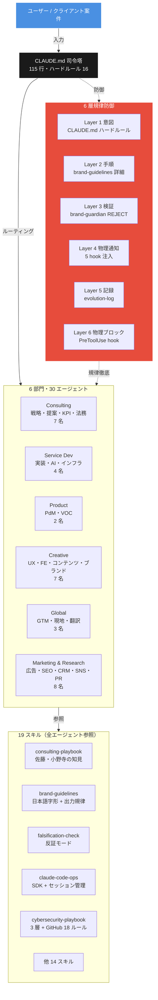
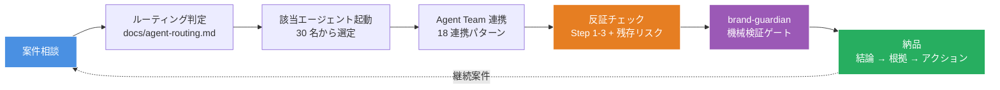
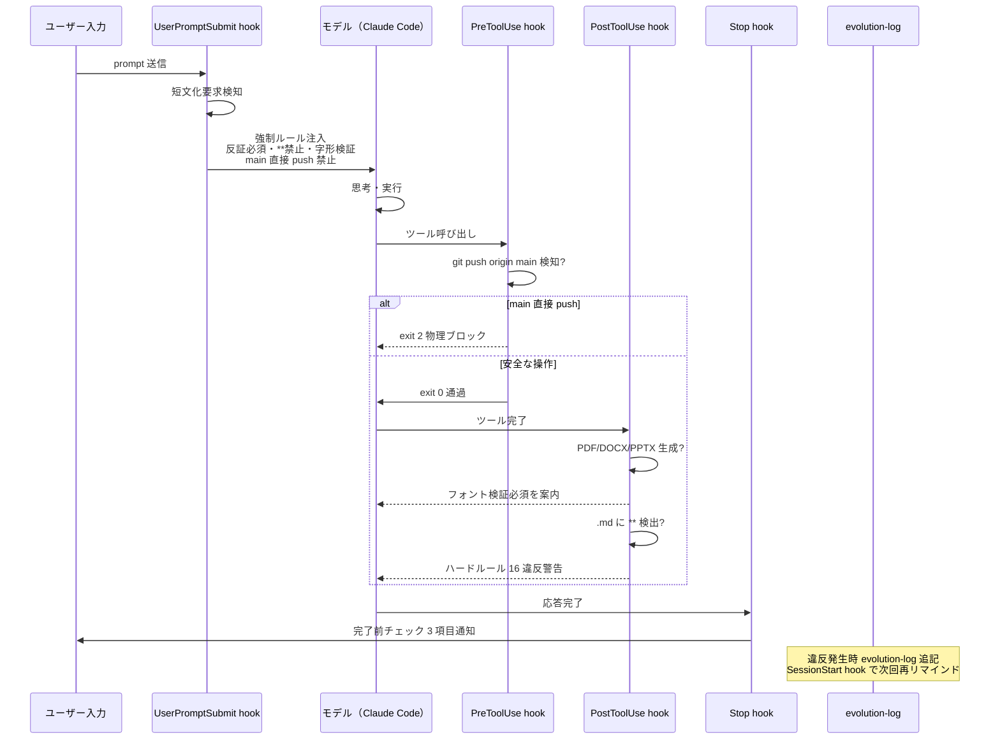
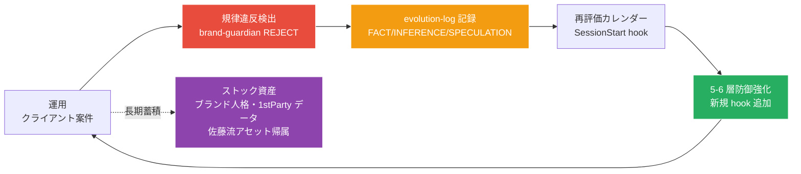

# ConsultingOS

コンサル / サービス開発 / プロダクト / クリエイティブ / グローバル / マーケティングの 6 部門・30 エージェント・19 スキルで提案から実装・海外展開・マーケまで一気通貫のマルチエージェント OS。

## 司令塔ダイアグラム（1 枚で構造把握）



## バリューチェーン（クライアント案件の流れ）



## 6 層防御の発動順序



## 司令塔ダイアグラム（自己進化サイクル）



## 商業実績

| 案件 | クライアント | 内容 | 受注金額 | 期間 | ステータス |
|---|---|---|---|---|---|
| Hotice セールスデッキ | Hotice（performance marketing agency） | B2B セールスデッキ HTML/CSS 18 スライド + Puppeteer レンダリングパイプライン | 月 5 万円 | 3 ヶ月（15 万円） | 受注済 |

成果物は [`examples/hotice-sales-deck/`](./examples/hotice-sales-deck/) に格納。sales-deck-designer + brand-guardian + claude-design-handoff スキル経由で制作。佐藤裕介モード（具体性・ハルシネーション検出・競合比較表）+ 日本語字形禁則 + 出力フォーマット規律を全適用。

## 構成サマリ

| 項目 | 値 |
|---|---|
| エージェント | 30 名（6 部門） |
| スキル | 19 件 |
| コマンド | 6 個 |
| CLAUDE.md | 115 行・ハードルール 16 |
| 防御層 | 6 層 × 4 系統（反証 / 字形 / 出力フォーマット / 規律違反学習） |
| hook | 5 種（UserPromptSubmit / PreToolUse / PostToolUse / Stop / SessionStart） |
| evolution-log | 違反学習 7 件記録 |
| 再評価カレンダー | 7 項目（自動通知） |
| SDK 化 | Phase 1 PoC（claude-code-action@v1） |

## 主要規律

| 規律 | 出典 |
|---|---|
| 反証モード Step 1-3 + 残存リスク必須 | OS 独自規律 |
| 出典 3 ラベル（FACT / INFERENCE / SPECULATION）| 2026-05-01 違反学習 |
| 日本語字形検証必須（pdffonts / unzip+grep）| 2026-05-01 違反学習 |
| 出力フォーマット規律（`**` 禁止 / 改行 / 中央揃え / 収まり / W チェック）| 2026-05-01 違反学習 |
| main 直接 push 禁止（PreToolUse 物理ブロック）| 2026-05-02 違反学習 |
| GitHub アカウントセキュリティ 18 ルール | マネーフォワード事案学習 |

## 思想的基盤

- 佐藤裕介流: PL 思考・市場構造・3 変数交点・アセット帰属診断・コンセンサス疑念・ruthlessly edit
- 小野寺信行流: 指標を疑う・1stParty データ中心・フロー × ストック統合・代理店 R&D 機関化
- Boris Cherny 流 9 規律: Plan Mode・自己検証・形骸化ルール削除・権限明示
- Anthropic 公式（Sid Bidasaria SDK / Thariq セッション管理 5 つの術）

## Stage 進化ロードマップ

| Stage | 状態 | 例 | ConsultingOS の現在地 |
|---|---|---|---|
| 1. AIを使う | 対話的 | Claude Code セッション | 主軸 |
| 2. AIで自動化 | 単発タスクをコマンド化 | claude -p / パイプ | 一部活用 |
| 3. AIで出荷する | 本番システムに組み込み | GitHub Actions / SaaS | Phase 1 PoC 着手 |

## ファイル構成

```
consulting-os/
├── CLAUDE.md                  司令塔（115 行・ハードルール 16）
├── DESIGN.md                  UI 制作時参照
├── ICP.md                     マーケ・セールス時参照
├── README.md                  本ファイル
├── evolution-log.md           違反学習 + 再評価カレンダー
├── .claude/
│   ├── agents/                30 エージェント（6 部門）
│   ├── skills/                19 スキル
│   ├── commands/              6 コマンド
│   ├── hooks/                 5 hook（規律物理注入）
│   └── settings.json          permissions.deny + hook 設定
├── .github/workflows/         SDK Phase 1 PoC
├── docs/
│   ├── agent-routing.md       ルーティング判定ツリー
│   ├── agent-collaboration-patterns.md  18 連携パターン
│   └── sales-deck-rules.md    セールス資料規律
└── examples/
    └── hotice-sales-deck/     クライアント案件サンプル
```

## 詳細参照

- [`CLAUDE.md`](./CLAUDE.md): 司令塔・ハードルール 16
- [`evolution-log.md`](./evolution-log.md): 違反学習 + 再評価カレンダー
- [`docs/agent-routing.md`](./docs/agent-routing.md): ルーティング判定ツリー
- [`docs/agent-collaboration-patterns.md`](./docs/agent-collaboration-patterns.md): 18 連携パターン
- [`.claude/skills/claude-code-ops/SKILL.md`](./.claude/skills/claude-code-ops/SKILL.md): SDK + セッション管理
- [`.claude/skills/cybersecurity-playbook.md`](./.claude/skills/cybersecurity-playbook.md): 3 層 + GitHub 18 ルール
- [`.claude/skills/consulting-playbook.md`](./.claude/skills/consulting-playbook.md): 佐藤・小野寺の知見

## ライセンス

Private repository. クライアント案件機密情報を含む可能性あり。
